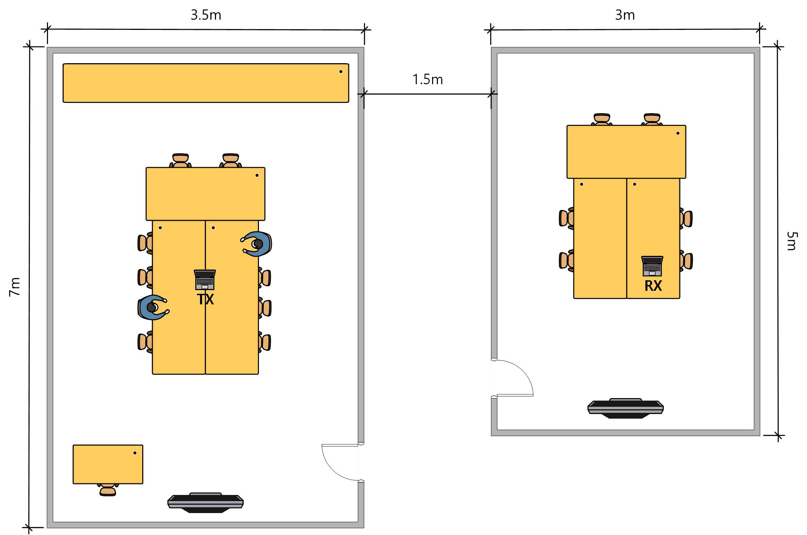
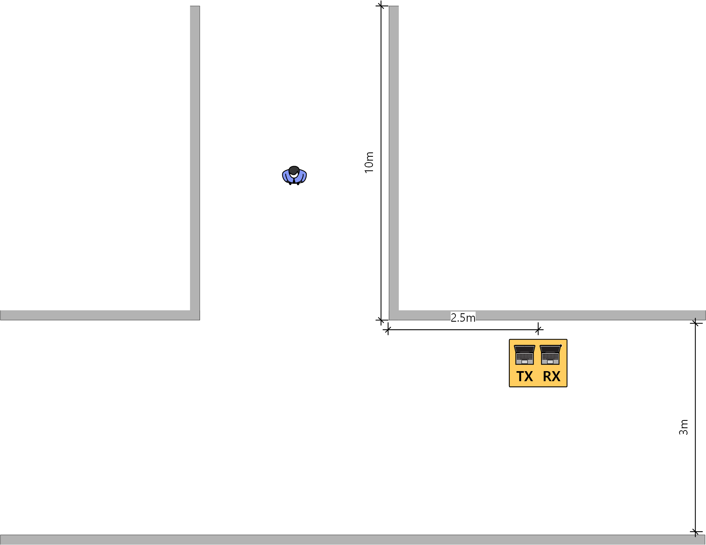

## Channel State Information (CSI) Amplitude Coloring Scheme for Enhancing Accuracy of an Indoor Occupancy Detection (IOD) System Using Wi-Fi Sensing

This repository contains the dataset collected from various CSI data measured in real-world experimental scenarios:

**Channel State Information (CSI) Amplitude Coloring Scheme for Enhancing Accuracy of an Indoor Occupancy Detection System Using Wi-Fi Sensing (MDPI 2024)**

\[[ paper ](https://www.mdpi.com/2076-3417/14/17/7850)\]

#### Pipeline for people counting via CSI amplitude coloring


## Experiments

We install the Nexmon CSI tool on a Raspberry Pi 4 with a single Wi-Fi receiving antenna to capture CSI. And we use an ESP8266 as the Wi-Fi transmitter to send Wi-Fi frames using only one transmitting antenna on the narrowest 20 MHz Wi-Fi channel.

**CSI measurement environments (Tx represents a Wi-Fi transmitter, and Rx represents a CSI receiver).**  
<p align="center">

 
 
</p>


TTW (Through The Wall) scenario, Queuing scenario and Corner scenario in order.

\[[ Dataset Link ](https://drive.google.com/drive/folders/1pO1Xi7RnD7vTVd7ao1ElDN2n5jYnwH2O?usp=sharing)\]

### Citation
If you find our dataset or paper useful, please consider citing:
```
Son, J.; Park, J. Channel State Information (CSI) Amplitude Coloring Scheme for Enhancing Accuracy of an Indoor
Occupancy Detection System Using Wi-Fi Sensing. Appl. Sci. 2024, 14, 7850. https://doi.org/10.3390/app14177850
```
